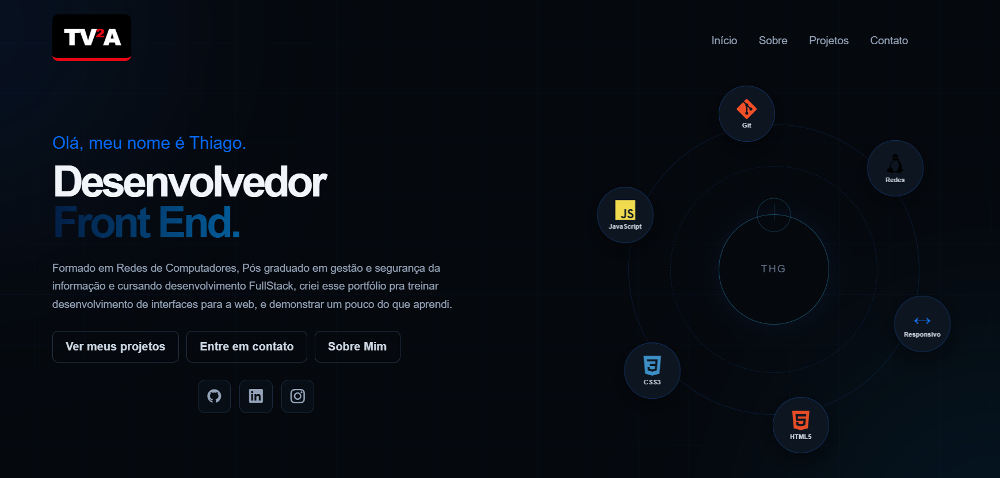

Portfólio | Thiago Aguiar

Portfólio pessoal desenvolvido para apresentar um pouco da minha trajetória, meus conhecimentos e alguns dos projetos que venho desenvolvendo durante meus estudos em desenvolvimento web.

A ideia do projeto é ter uma página simples, organizada e responsiva para centralizar meus projetos e facilitar o contato.

Sobre o projeto

Esse portfólio foi criado principalmente como parte dos meus estudos em Front End.

Além de apresentar meus projetos, aproveitei o desenvolvimento da página para praticar estruturação de páginas, estilização, responsividade e interação com JavaScript.

O projeto ainda está em evolução e pretendo continuar melhorando a interface e adicionando novos projetos conforme avanço nos estudos.

Seções

O portfólio possui algumas seções principais:

Inicio: apresentação e principais tecnologias.
Sobre: um pouco da minha formação e objetivos.
Projetos:  projetos desenvolvidos durante meus estudos.
Contato: espaço para entrar em contato por e-mail.

 Projetos apresentados

Atualmente, o portfólio apresenta projetos como:

- Agenda Web
- Calculadora
- Controle Financeiro
- Lista de Tarefas
- Site Institucional
- Portfólio

Os projetos foram desenvolvidos com o objetivo de praticar diferentes conceitos do desenvolvimento web.

Tecnologias utilizadas

- HTML5
- CSS3
- JavaScript
- Git
- Devicon
- Bootstrap Icons

(Também foram utilizadas bibliotecas externas para os ícones presentes na página.)

O que foi praticado

Durante o desenvolvimento desse projeto, pratiquei principalmente:

- Estruturação de páginas com HTML
- Organização de estilos com CSS
- Criação de layouts responsivos
- Manipulação do DOM
- Eventos com JavaScript
- Navegação entre seções da página
- Organização de projetos Front End
- Utilização de bibliotecas de ícones
- Controle de versão com Git

Responsividade

A página foi pensada para funcionar em diferentes tamanhos de tela, como computadores, tablets e celulares (@media).

Ainda existem pontos que podem ser melhorados na responsividade e fazem parte das próximas etapas do projeto.

Sobre mim

Sou formado em Redes de Computadores, pós-graduado em Gestão e Segurança da Informação e atualmente venho me especializando em desenvolvimento Full Stack.

Tenho focado principalmente no desenvolvimento Front End, buscando melhorar meus conhecimentos através da criação de projetos e da prática constante.

Este portfólio faz parte desse processo de aprendizado.

